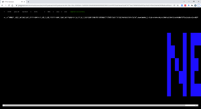

# ByteScRoll

Apologies to everyone. pestis / bC! @ lovebyte 2022 256b bytebeat competition.

Should be played with Greggman bytebeat thingy, using the following settings:
- bytebeat
- infix
- 8 kHz

[Listen online](https://greggman.com/downloads/examples/html5bytebeat/html5bytebeat.html#t=0&e=0&s=8000&bb=5d00000100fe0000000000000000398f47e3d1ff95536a05dba452e0872677b4a7369889268a83f5ab1ffa6316f2b624fa9d6206ff8a8cd4936e4550c640a8904d73f2df6d0b8686f4f9daac0b0bd01325dc2f4376fb9c997c1ef68824218a39789cf73bcfa4cb14956ac5080b2f75c2bcc84108c810a89ad9bb109286252931953562fa8b01b123e4126d17760660f9de4648753f1ddf488ee47c353f3e193a1812d5d581292e45c7930baf24aaa7d10f86e8cc7129b8d6c92ec289c7ffa6ada96b47f31f5a8170d03610f4b2306dbd3f053efff0ba5000)

License: [MIT](LICENSE)

